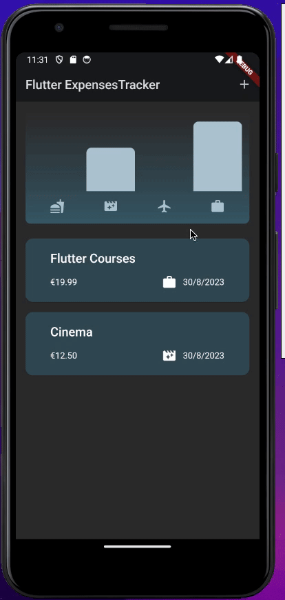

</a>

# Expense Tracker • Flutter

At the heart of this Flutter project lies a user-friendly mobile application designed to streamline expense management. With a primary focus on ease-of-use and practicality, this app empowers users to meticulously track and document their financial outlays. The application's core functionality revolves around the concept of categorizing expenditures, allowing users to assign expenses to specific categories such as 'Food,' 'Travel,' 'Entertainment,' and more.
 

Through an intuitive and visually appealing interface, users can effortlessly input various expenses, specifying the amount spent, the date of expenditure, and selecting an appropriate category. This comprehensive categorization not only aids in maintaining a structured financial record but also offers valuable insights into spending patterns over time.
 

One of the standout features of the app is its ability to present data in a highly informative manner. The inclusion of graphical representations, such as charts and graphs, enables users to gain a quick and insightful overview of their spending habits. These visual aids highlight the distribution of expenses across different categories, making it easier for users to identify areas where cost-saving measures could be implemented.
 

Furthermore, the app prioritizes user autonomy by providing the option to edit or delete recorded expenses. This feature ensures that the financial record remains accurate and up-to-date, allowing users to make real-time adjustments as needed.
 

In summary, this Flutter-based expense management app not only simplifies the process of recording and categorizing expenses but also empowers users with valuable tools to analyze their spending behavior. By combining user-friendly design with practical features such as expense categorization, data visualization, and editing capabilities, the app becomes an indispensable companion for anyone seeking better financial control and understanding.
 

